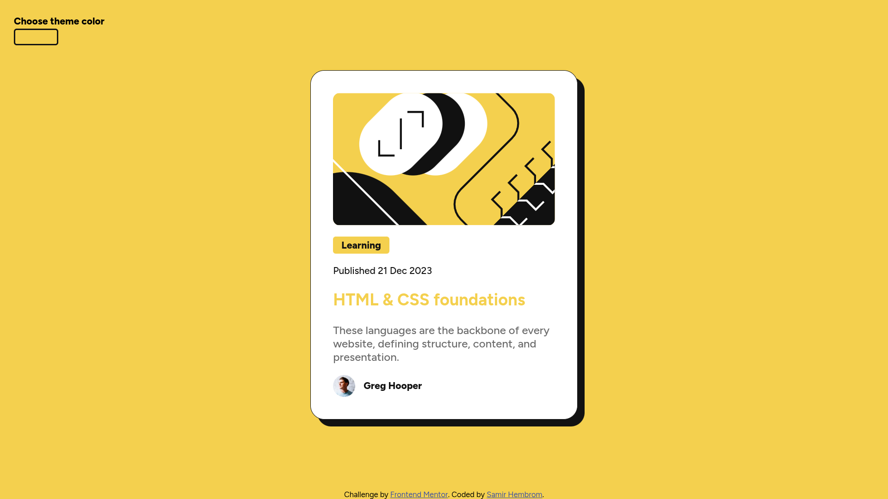
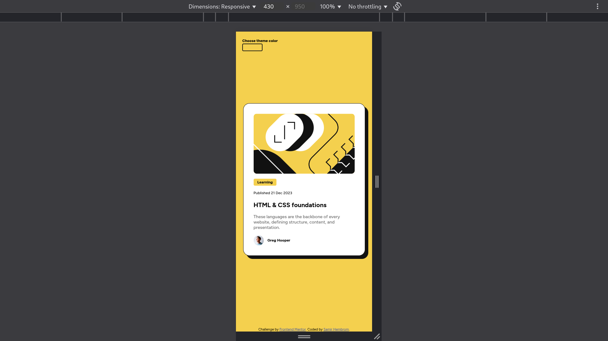
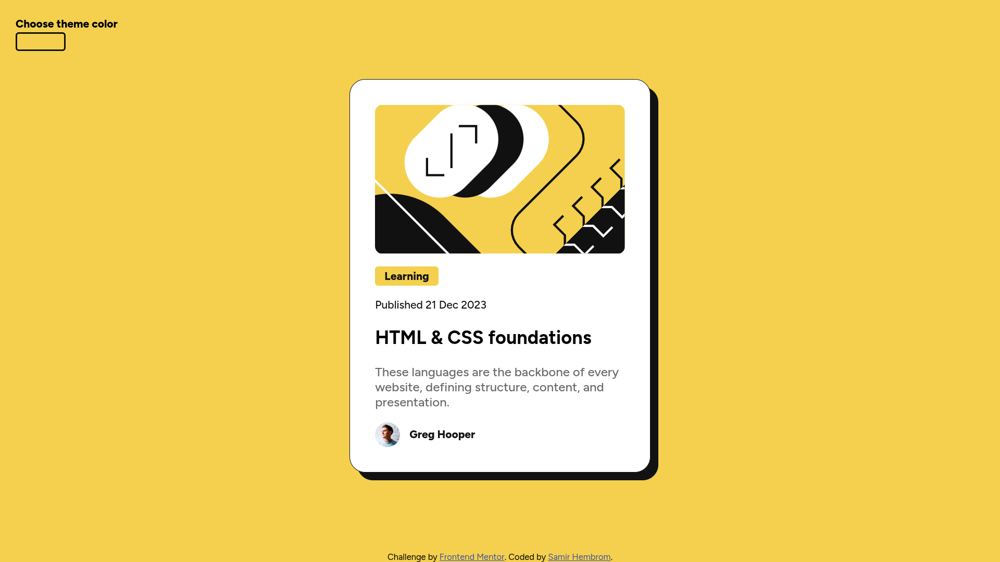

# Frontend Mentor - Blog preview card solution

This is a solution to the [Blog preview card challenge on Frontend Mentor](https://www.frontendmentor.io/challenges/blog-preview-card-ckPaj01IcS). Frontend Mentor challenges help you improve your coding skills by building realistic projects. 

## Table of contents

- [Overview](#overview)
  - [The challenge](#the-challenge)
  - [Screenshot](#screenshot)
  - [Links](#links)
- [My process](#my-process)
  - [Built with](#built-with)
  - [What I learned](#what-i-learned)
  - [Continued development](#continued-development)
- [Author](#author)

## Overview

### The challenge

There is a hover state and an input button for users to play around.

### Screenshot





### Links

- Solution URL: [Link to repo](https://github.com/samirhembrom/blogcard)
- Live Site URL: [Link to live page](https://your-live-site-url.com)

## My process

### Built with

- Semantic HTML5 markup
- CSS custom properties
- Flexbox


### What I learned

I saw one video where Kevin Powell was suggesting to do something more than the challenge, so I did try to use something from the video. I used the documentElement.style.setProperty to set the primary color of the whole website.
```html
<path class="illustration-path" d="M0 .5h336v200H0z" />
```
```js
document.getElementById("color-button").addEventListener("click", () => {
    document.getElementById("real-color-input").click();
});

document.getElementById("real-color-input").addEventListener("input", (e) => {
    const color = e.target.value;
    document.getElementById("color-button").style.background = color;
    document.documentElement.style.setProperty("--clr-primary", color);
});
```


### Continued development

The js code is something I think I could use in my future projects to make it more customizable for everyone.

## Author

- Frontend Mentor - [@samirhembrom](https://www.frontendmentor.io/profile/samirhembrom)
